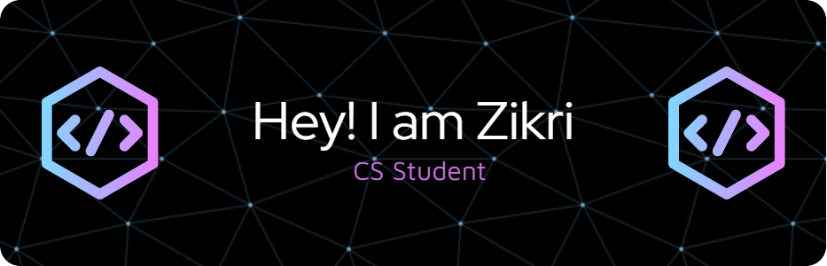

## Hi there 👋

<!--
**zikriharis/zikriharis** is a ✨ _special_ ✨ repository because its `README.md` (this file) appears on your GitHub profile.

# Introduction
Hi! I'm Zikri, a student in the Framework-Based Software Design and Development course. 
I am a beginner in software development, I look forward to learn from you all.

  <!-- https://github.com/Framework-Based-Software/icebreaking-crescenticsun/blob/profile-upload/IMG-20240527-WA0118.jpg -->

## My experience
  

### My interest
In my spare time, I play aound with techs that interest me such as configuring PXE boot server, docker container and compose, virtualization, media server and tailscale.

Since I'm a beginner in playing guitar I'm interested in building a simple ML model that can check playing posture in real time; I've got this idea from learning OpenCV last semester in autonomous robotic class using ROS.

My interest in CS mostly in the automation part since I like to make my life easier.

#### GitHub Profile

You can view my personalized GitHub profile: https://github.com/zikriharis
